# 🗄️ HOMIES BUDDY - DATABASE DIAGRAM

> Database Schema & Entity Relationship Diagram cho Homies Buddy Developer

**Last Updated:** March 6, 2026

---

## 📊 Mermaid ER Diagram

```mermaid
erDiagram
    USER_PROFILE {
        string id PK
        string email
        string username
        string fullName
        string avatarUrl
        string coverUrl
        datetime dateOfBirth
        boolean isEmailVerified
        int followerCount
        int followingCount
        datetime createdAt
        datetime updatedAt
    }

    USER_PROFILE {
        string id PK
        string username UK "unique @handle"
        string fullName
        string avatarUrl
        string coverUrl
        string headline
        string bio
        string location
        int followerCount "⚠️ denormalized - sync on USER_FOLLOWS insert/delete"
        int followingCount "⚠️ denormalized - sync on USER_FOLLOWS insert/delete"
        enum role "user | admin"
        datetime createdAt
    }

    FEED_POST {
        string postId PK
        string authorId FK
        string authorName
        string authorAvatar
        string contentText
        list hashtags "List of String"
        list mentions "List of String"
        int reactsCount "⚠️ denormalized - sync on POST_LIKES insert/delete"
        int commentCount "⚠️ denormalized - sync on FEED_COMMENT insert/delete"
        enum privacy "public | friends | private"
        datetime createdAt
        datetime updatedAt
    }

    MEDIA_FILE {
        string id PK
        string postId FK "added: link to FEED_POST"
        string mediaUrl
        string thumbnailUrl
        enum mediaType "image | video | album"
        double mediaAspectRatio
        int width
        int height
        int durationSeconds "nullable - video only"
    }

    FEED_COMMENT {
        string commentId PK
        string postId FK
        string authorId FK
        string authorName
        string authorAvatar
        string contentText
        int reactCount
        datetime createdAt
        datetime updatedAt
    }

    COMMENT_REACTS {
        string userId FK
        string commentId FK
        datetime createdAt
    }

    FEED_NOTIFICATION {
        string notificationId PK
        string actorId FK
        string recipientId FK "added: người NHẬN notification"
        string actorName
        string actorAvatar
        enum type "react | comment | follow | mention | share"
        string postId FK
        string commentId FK "nullable"
        string deepLink
        string contentPreview
        boolean isRead
        datetime createdAt
    }

    MOMENT_NOTE {
        string id PK
        string userId FK "added: link to USER_PROFILE"
        string authorName
        string authorAvatarUrl
        string textContent
        list mediaUrls "List of String"
        datetime createdAt
    }

    PET {
        string id PK
        string userId FK
        string name
        enum avatarType "cat_a | cat_b | cat_c"
        float baseline_energy "random at creation, immutable"
        float energy "current realtime energy"
        enum current_mood "idle | sleep | tired | sad | grumpy | look_away | happy | playful | curious | clingy | content | startled"
        int streak "consecutive days active"
        datetime lastInteractedAt "used to compute delta_t"
        datetime createdAt
        datetime updatedAt
    }

    PET_STATE_SNAPSHOT {
        string id PK
        string petId FK
        string userId FK
        float delta_t "hours since last interaction"
        int visit_count_today
        int interaction_count_today
        float energy_at_snapshot
        enum mood_at_snapshot "same enum as PET.current_mood"
        int time_of_day "hour 0-23"
        datetime recordedAt
    }

    NOTE_ANALYSIS {
        string id PK
        string noteId FK "unique - 1:1 with MOMENT_NOTE"
        string userId FK
        enum last_user_tone "very_happy | happy | neutral | sad | very_sad | anxious | angry"
        enum current_tone_predict "same enum as last_user_tone"
        boolean tone_repeat "repeated tone vs previous note"
        int level "1-5 emotion intensity"
        datetime analyzedAt
        string rawLLMResponse "nullable - for debugging"
    }

    USER_EMOTIONAL_TREND {
        string id PK
        string userId FK "unique - 1 record per user"
        enum emotional_trend "improving | declining | stable | volatile"
        float emotional_momentum "-1.0 to +1.0"
        list tone_history_7d "List of tone enums - last 7 days"
        enum dominantTone "most frequent tone in 7 days"
        datetime updatedAt
    }

    CONVERSATION {
        string id PK
        list participantIds "List of String"
        string participantName
        string participantAvatar
        string lastMessage
        int unreadCount
        string nickname "nullable"
        datetime mutedUntil "nullable"
        datetime lastUpdated
    }

    MESSAGE {
        string id PK
        string conversationId FK
        string senderId FK
        string content
        list mediaUrls "List of String - replaces single image type"
        enum type "text | image"
        enum status "sending | sent | delivered | seen | failed"
        datetime createdAt
    }

    MESSAGE_RECEIPT {
        string messageId FK
        string userId FK
        datetime deliveredAt "nullable"
        datetime seenAt "nullable"
    }

    HELP_CHAT_MESSAGE {
        string id PK
        string conversationId FK "added: link to HELP_CONVERSATION_HISTORY"
        string text
        boolean isUser
        list imageUrls "List of String"
        datetime timestamp
    }

    HELP_CONVERSATION_HISTORY {
        string id PK
        string userId FK "added: link to USER_PROFILE"
        string title
        string preview
        datetime lastMessageAt
    }

    HELP_SUGGESTION {
        string id PK
        string title
        enum iconType "plant | pet | health | training | nutrition | grooming"
    }

    USER_BUDDIES {
        string userId FK
        string buddyId FK
    }

    POST_LIKES {
        string userId FK
        string postId FK
        datetime createdAt
    }

    USER_FOLLOWS {
        string followerId FK
        string followingId FK
        datetime createdAt
    }

    AUTH_USER ||--|| USER_PROFILE : "extends to"
    USER_PROFILE ||--o{ FEED_POST : "authors"
    USER_PROFILE ||--o{ FEED_COMMENT : "writes"
    USER_PROFILE ||--o{ FEED_NOTIFICATION : "triggers as actor"
    USER_PROFILE ||--o{ MOMENT_NOTE : "creates"
    USER_PROFILE }o--o{ USER_BUDDIES : "has homies"
    FEED_POST ||--o{ MEDIA_FILE : "contains"
    FEED_POST ||--o{ FEED_COMMENT : "has"
    FEED_POST ||--o{ FEED_NOTIFICATION : "referenced in"
    CONVERSATION ||--o{ MESSAGE : "contains"
    CONVERSATION }o--o{ USER_PROFILE : "participates"
    MESSAGE ||--o{ MESSAGE_RECEIPT : "tracked by"
    MESSAGE_RECEIPT }o--|| USER_PROFILE : "belongs to"
    HELP_CONVERSATION_HISTORY ||--o{ HELP_CHAT_MESSAGE : "contains"
    USER_PROFILE ||--o{ HELP_CONVERSATION_HISTORY : "owns"
    USER_PROFILE ||--o| PET : "owns"
    PET ||--o{ PET_STATE_SNAPSHOT : "logs"
    MOMENT_NOTE ||--o| NOTE_ANALYSIS : "analyzed by"
    USER_PROFILE ||--o| USER_EMOTIONAL_TREND : "has trend"
    NOTE_ANALYSIS }o--|| USER_EMOTIONAL_TREND : "feeds into"
    USER_PROFILE }o--o{ POST_LIKES : "likes"
    FEED_POST }o--o{ POST_LIKES : "liked by"
    USER_PROFILE }o--o{ USER_FOLLOWS : "follows"
    USER_PROFILE }o--o{ COMMENT_REACTS : "reacts"
    FEED_COMMENT }o--o{ COMMENT_REACTS : "reacted by"
```



---

## 🗃️ Storage Layer Assignment

Dự án dùng **3 storage riêng biệt** tùy theo tính chất dữ liệu:

| Storage | Lý do chọn |
|---|---|
| **Firestore** | Realtime built-in, phù hợp dữ liệu cần sync ngay lập tức (chat, notification) |
| **Supabase PostgreSQL** | Relational, phù hợp dữ liệu có cấu trúc phức tạp, query nặng, analytics |
| **Firebase Storage** | Binary file storage (ảnh/video) — Supabase chỉ lưu URL metadata |

> ⚠️ **Lưu ý:** Diagram ghi "Real-time: WebSocket (socket_io_client)" là **không còn chính xác**. Vì Firestore đã có realtime built-in, **không cần** socket_io_client — chạy 2 realtime systems song song là phức tạp không cần thiết. Tech Stack đã được cập nhật bên dưới.

### 🔥 Firestore (Realtime)

| Entity | Lý do |
|---|---|
| `CONVERSATION` | Cần sync realtime khi có tin nhắn mới |
| `MESSAGE` | Core realtime — listener cập nhật ngay khi gửi/nhận |
| `MESSAGE_RECEIPT` | Trạng thái seen/delivered cần cập nhật tức thì |
| `FEED_NOTIFICATION` | Push notification realtime cho user |

### 🐘 Supabase PostgreSQL

| Entity | Lý do |
|---|---|
| `USER_PROFILE` | Relational, join nhiều bảng, ít thay đổi realtime |
| `FEED_POST` | Structured query, filter, sort, pagination |
| `FEED_COMMENT` | Belongs to post — relational join |
| `USER_BUDDIES` | Many-to-Many junction table |
| `POST_LIKES` | ⭐ **Mới** — Junction table likes, composite PK |
| `USER_FOLLOWS` | ⭐ **Mới** — Junction table follows, composite PK |
| `COMMENT_REACTS` | ⭐ **Mới** — Junction table reacts on comments, composite PK |
| `PET` | Structured, cập nhật batch không cần realtime |
| `PET_STATE_SNAPSHOT` | Append-only log, query analytics |
| `NOTE_ANALYSIS` | LLM result storage, 1:1 với MOMENT_NOTE |
| `USER_EMOTIONAL_TREND` | Aggregated data, upsert định kỳ |
| `MOMENT_NOTE` | Personal notes, không cần sync realtime |
| `HELP_CONVERSATION_HISTORY` | Session history, query by userId |
| `HELP_CHAT_MESSAGE` | Chat log với AI bot |
| `HELP_SUGGESTION` | Static master data |
| `MEDIA_FILE` | Metadata only (URL string) — binary file thực lưu Firebase Storage |

### 🗂️ Firebase Storage (Binary Files)

| Path pattern | Nội dung |
|---|---|
| `avatars/{userId}/img.jpg` | → `avatarUrl` trong `USER_PROFILE` |
| `posts/{postId}/video.mp4` | → `mediaUrl` trong `MEDIA_FILE` |
| `covers/{userId}/cover.jpg` | → `coverUrl` trong `USER_PROFILE` |

---

## 📋 Entity Overview (21 Entities)

### 🔐 Authentication & User Management

#### 1. **AUTH_USER**
**Source:** [lib/features/auth/data/models/user_model.dart](lib/features/auth/data/models/user_model.dart)

Thông tin xác thực cơ bản của user (lightweight model).

| Field | Type | Description |
|---|---|---|
| `id` | string (PK) | User ID duy nhất |
| `email` | string | Email đăng nhập |
| `fullName` | string | Tên đầy đủ |
| `avatarUrl` | string? | URL avatar |
| `phoneNumber` | string? | Số điện thoại |
| `dateOfBirth` | datetime? | Ngày sinh |
| `isEmailVerified` | boolean | Trạng thái xác thực email |
| `createdAt` | datetime? | Thời gian tạo tài khoản |
| `updatedAt` | datetime? | Thời gian cập nhật cuối |

---

#### 2. **USER_PROFILE** *(updated)*
**Source:** [lib/data/models/user_model.dart](lib/data/models/user_model.dart)

Social profile đầy đủ với thông tin cộng đồng (SINGLE SOURCE OF TRUTH).

| Field | Type | Description |
|---|---|---|
| `id` | string (PK) | User ID |
| `username` | string (UK) | Username duy nhất (@handle) |
| `fullName` | string | Tên hiển thị |
| `avatarUrl` | string | Avatar tròn |
| `coverUrl` | string? | Ảnh bìa profile |
| `headline` | string? | Tiêu đề lớn (vd: "YOGA IN LIFE") |
| `bio` | string? | Giới thiệu bản thân |
| `location` | string? | Vị trí địa lý |
| `followerCount` | int | Số lượng người theo dõi ⚠️ *denormalized* |
| `followingCount` | int | Số lượng đang theo dõi ⚠️ *denormalized* |

> ⚠️ **Denormalized counters:** `followerCount` và `followingCount` phải được update mỗi khi INSERT/DELETE vào `USER_FOLLOWS`. Thực hiện qua **Supabase Database Trigger** hoặc **Cloud Function**.
| ~~`isFollowedByMe`~~ | ~~boolean~~ | ❌ **Đã xóa** — computed field, query từ `USER_FOLLOWS` |
| `role` | enum | Vai trò: `user` \| `admin` |
| `createdAt` | datetime? | Thời gian tạo |

**Relationships:**
- Has many: `FEED_POST`, `FEED_COMMENT`, `FEED_NOTIFICATION`, `MOMENT_NOTE`
- Many-to-Many: `USER_BUDDIES` (Homies/bạn bè)
- Many-to-Many: `USER_FOLLOWS` (Follow/Follower)

---

#### 3. **USER_BUDDIES**
**Source:** Embedded trong `UserModel.humanBuddies`

Quan hệ bạn bè giữa các users (Many-to-Many).

| Field | Type | Description |
|---|---|---|
| `userId` | string (FK) | User ID |
| `buddyId` | string (FK) | Friend User ID |

---

#### 3b. **POST_LIKES** *(New)*
**Source:** `lib/features/feed/data/models/post_likes_model.dart` *(planned)*

Junction table lưu trạng thái like của user với bài post. Thay thế cho computed field `isLikedByMe` trên `FEED_POST`.

| Field | Type | Description |
|---|---|---|
| `userId` | string (FK, PK) | User ID người like |
| `postId` | string (FK, PK) | Post ID được like |
| `createdAt` | datetime | Thời gian like |

> **PK:** Composite key `(userId, postId)` — mỗi user chỉ like một post một lần.

**Relationships:**
- Belongs to: `USER_PROFILE`, `FEED_POST`

---

#### 3c. **USER_FOLLOWS** *(New)*
**Source:** `lib/features/profile/data/models/user_follows_model.dart` *(planned)*

Junction table lưu quan hệ follow giữa users. Thay thế cho computed field `isFollowedByMe` trên `USER_PROFILE`.

| Field | Type | Description |
|---|---|---|
| `followerId` | string (FK, PK) | User ID người follow |
| `followingId` | string (FK, PK) | User ID người được follow |
| `createdAt` | datetime | Thời gian follow |

> **PK:** Composite key `(followerId, followingId)` — mỗi cặp follow là duy nhất.

**Relationships:**
- Both sides belong to: `USER_PROFILE`

---

### 🌟 Community Feed (Tab Community)

#### 4. **FEED_POST** *(updated)*
**Source:** [lib/data/models/post_model.dart](lib/data/models/post_model.dart)

Bài viết trong Community Feed.

| Field | Type | Description |
|---|---|---|
| `postId` | string (PK) | Post ID duy nhất |
| `authorId` | string (FK) | User ID của tác giả |
| `authorName` | string | Tên tác giả |
| `authorAvatar` | string | Avatar tác giả |
| `contentText` | string | Nội dung bài viết |
| `hashtags` | List\<String\> | Danh sách hashtags |
| `mentions` | List\<String\> | Danh sách mentions (@username) |
| `reactsCount` | int | Số lượng react ⚠️ *denormalized* |
| `commentCount` | int | Số lượng comment ⚠️ *denormalized* |

> ⚠️ **Denormalized counters:** `reactsCount` và `commentCount` phải được update mỗi khi INSERT/DELETE vào `POST_LIKES` hoặc `FEED_COMMENT`. Thực hiện qua **Supabase Database Trigger** hoặc **Cloud Function**.
| ~~`isLikedByMe`~~ | ~~boolean~~ | ❌ **Đã xóa** — computed field, query từ `POST_LIKES` |
| `privacy` | enum | Chế độ: `public` \| `friends` \| `private` |
| `createdAt` | datetime | Thời gian đăng |
| `updatedAt` | datetime? | Thời gian chỉnh sửa |

**Relationships:**
- Belongs to: `USER_PROFILE`
- Has many: `MEDIA_FILE`, `FEED_COMMENT`, `FEED_NOTIFICATION`
- Many-to-Many: `POST_LIKES`

---

#### 5. **MEDIA_FILE** *(updated)*
**Source:** [lib/data/models/media_file_model.dart](lib/data/models/media_file_model.dart)

Metadata của file media đính kèm trong` bài post. File binary thực tế lưu trên **Firebase Storage**, bảng này chỉ lưu URL và metadata.

| Field | Type | Description |
|---|---|---|
| `id` | string (PK) | Media ID |
| `postId` | string (FK) | ⭐ **Thêm mới** — Post ID chủ sở hữu |
| `mediaUrl` | string | URL media chính (từ Firebase Storage) |
| `thumbnailUrl` | string? | URL thumbnail |
| `mediaType` | enum | Loại: `image` \| `video` \| `album` |
| `mediaAspectRatio` | double | Tỷ lệ khung hình |
| `width` | int | Chiều rộng (px) |
| `height` | int | Chiều cao (px) |
| `durationSeconds` | int? | Thời lượng video (giây) |

**Relationships:**
- Belongs to: `FEED_POST`

> **Storage Note:** `mediaUrl` là string URL trỏ đến file trên Firebase Storage (binary). Supabase chỉ lưu metadata (text/string).

---

#### 6. **FEED_COMMENT** *(updated)*
**Source:** [lib/data/models/comment_model.dart](lib/data/models/comment_model.dart)

Bình luận trên bài post.

| Field | Type | Description |
|---|---|---|
| `commentId` | string (PK) | Comment ID |
| `postId` | string (FK) | Post ID |
| `authorId` | string (FK) | User ID người comment |
| `authorName` | string | Tên người comment |
| `authorAvatar` | string | Avatar người comment |
| `contentText` | string | Nội dung comment |
| `reactCount` | int | Số lượng react |
| ~~`isReactedByMe`~~ | ~~boolean~~ | ❌ **Đã xóa** — computed field, query từ `COMMENT_REACTS` |
| `createdAt` | datetime | Thời gian comment |
| `updatedAt` | datetime? | Thời gian chỉnh sửa |

**Relationships:**
- Belongs to: `FEED_POST`, `USER_PROFILE`
- Many-to-Many: `COMMENT_REACTS`

---

#### 6b. **COMMENT_REACTS** *(New)*
**Source:** `lib/features/feed/data/models/comment_reacts_model.dart` *(planned)*

Junction table lưu trạng thái react của user với comment. Tương tự `POST_LIKES`, thay thế computed field `isReactedByMe` trên `FEED_COMMENT`.

| Field | Type | Description |
|---|---|---|
| `userId` | string (FK, PK) | User ID người react |
| `commentId` | string (FK, PK) | Comment ID được react |
| `createdAt` | datetime | Thời gian react |

> **PK:** Composite key `(userId, commentId)` — mỗi user chỉ react một comment một lần.

**Relationships:**
- Belongs to: `USER_PROFILE`, `FEED_COMMENT`

---

#### 7. **FEED_NOTIFICATION** *(updated)*
**Source:** [lib/data/models/notification_model.dart](lib/data/models/notification_model.dart)

Thông báo về hoạt động trong Community.

| Field | Type | Description |
|---|---|---|
| `notificationId` | string (PK) | Notification ID |
| `actorId` | string (FK) | ✅ User ID người **GỬI** / thực hiện action |
| `recipientId` | string (FK) | ⭐ **Thêm mới** — User ID người **NHẬN** notification |
| `actorName` | string | Tên người thực hiện |
| `actorAvatar` | string | Avatar người thực hiện |
| `type` | enum | Loại: `react` \| `comment` \| `follow` \| `mention` \| `share` |
| `postId` | string (FK) | Post liên quan |
| `commentId` | string? (FK) | Comment liên quan (nullable) |
| `deepLink` | string | Deep link đến nội dung |
| `contentPreview` | string? | Xem trước nội dung |
| `isRead` | boolean | Đã đọc chưa |
| `createdAt` | datetime | Thời gian tạo |

**Relationships:**
- Belongs to: `USER_PROFILE` (actor), `USER_PROFILE` (recipient), `FEED_POST`

---

### 🏠 Home Tab

#### 8. **MOMENT_NOTE** *(updated)*
**Source:** [lib/data/models/moment_note_model.dart](lib/data/models/moment_note_model.dart)

Ghi chú/khoảnh khắc cá nhân trên trang Home. *(Thêm `userId` FK để liên kết với `NOTE_ANALYSIS`)*

| Field | Type | Description |
|---|---|---|
| `id` | string (PK) | Note ID |
| `userId` | string (FK) | ⭐ **Thêm mới** — User ID chủ sở hữu |
| `authorName` | string | Tên tác giả |
| `authorAvatarUrl` | string | Avatar tác giả |
| `textContent` | string | Nội dung text |
| `mediaUrls` | List\<String\> | Danh sách URL media |
| `createdAt` | datetime | Thời gian tạo |

**Relationships:**
- Belongs to: `USER_PROFILE`
- Has one: `NOTE_ANALYSIS`

---

---

### 🐾 Pet Behavior Engine *(New)*

#### 9. **PET**
**Source:** `lib/features/pet/data/models/pet_model.dart` *(planned)*

Model core của pet ảo — lưu toàn bộ trạng thái tĩnh và động của pet.

| Field | Type | Description |
|---|---|---|
| `id` | string (PK) | Pet ID |
| `userId` | string (FK) | User sở hữu pet |
| `name` | string | Tên pet |
| `avatarType` | enum | Loại skin/giống: `cat_a` \| `cat_b` \| `cat_c` |
| `baseline_energy` | float | ⚡ Năng lượng bẩm sinh — random lúc tạo, **bất biến** |
| `energy` | float | Năng lượng hiện tại (realtime, decay theo thời gian) |
| `current_mood` | enum | Trạng thái hiện tại: `idle` \| `sleep` \| `tired` \| `sad` \| `grumpy` \| `look_away` \| `happy` \| `playful` \| `curious` \| `clingy` \| `content` \| `startled` |
| `streak` | int | Số ngày liên tiếp user active |
| `lastInteractedAt` | datetime | Lần tương tác cuối — dùng để tính `delta_t` |
| `createdAt` | datetime | Thời gian tạo pet |
| `updatedAt` | datetime | Thời gian cập nhật cuối |

**Relationships:**
- Belongs to: `USER_PROFILE`
- Has many: `PET_STATE_SNAPSHOT`

> **Note:** `baseline_energy` xác định personality archetype — `< 0.25` → Lazy, `0.25–0.5` → Calm, `0.5–0.75` → Curious, `> 0.75` → Hyper. Không bao giờ thay đổi sau khi tạo.

---

#### 10. **PET_STATE_SNAPSHOT**
**Source:** `lib/features/pet/data/models/pet_state_snapshot_model.dart` *(planned)*

Log trạng thái pet theo từng session — append-only. Dùng để tính `visit_count_today`, `emotion_recent_avg`, và debug behavior engine.

| Field | Type | Description |
|---|---|---|
| `id` | string (PK) | Snapshot ID |
| `petId` | string (FK) | Pet ID |
| `userId` | string (FK) | User ID |
| `delta_t` | float | Số giờ kể từ lần tương tác trước |
| `visit_count_today` | int | Số lần mở app trong ngày |
| `interaction_count_today` | int | Số lần tương tác với pet trong ngày |
| `energy_at_snapshot` | float | Giá trị energy tại thời điểm snapshot |
| `mood_at_snapshot` | enum | Trạng thái mood tại thời điểm snapshot |
| `time_of_day` | int | Giờ trong ngày (0–23) — dùng cho circadian modifier |
| `recordedAt` | datetime | Thời gian ghi nhận |

**Relationships:**
- Belongs to: `PET`, `USER_PROFILE`

---

#### 11. **NOTE_ANALYSIS**
**Source:** `lib/features/pet/data/models/note_analysis_model.dart` *(planned)*

Kết quả AI (LLM) phân tích tone cảm xúc của `MOMENT_NOTE`. Quan hệ **1:1** với `MOMENT_NOTE`.

| Field | Type | Description |
|---|---|---|
| `id` | string (PK) | Analysis ID |
| `noteId` | string (FK, unique) | Note ID — 1:1 với `MOMENT_NOTE` |
| `userId` | string (FK) | User ID |
| `last_user_tone` | enum | Tone của note trước đó |
| `current_tone_predict` | enum | Tone dự đoán của note hiện tại: `very_happy` \| `happy` \| `neutral` \| `sad` \| `very_sad` \| `anxious` \| `angry` |
| `tone_repeat` | boolean | Tone có lặp lại so với note trước? |
| `level` | int | Cường độ cảm xúc (1–5) |
| `analyzedAt` | datetime | Thời gian phân tích |
| `rawLLMResponse` | string? | Raw output của LLM (nullable, dùng để debug) |

**Relationships:**
- Belongs to: `MOMENT_NOTE`, `USER_PROFILE`
- Feeds into: `USER_EMOTIONAL_TREND`

---

#### 12. **USER_EMOTIONAL_TREND**
**Source:** `lib/features/pet/data/models/user_emotional_trend_model.dart` *(planned)*

Aggregated emotional trend 7 ngày — được tính toán sau mỗi note mới. Pet Behavior Engine đọc bảng này thay vì query lại toàn bộ lịch sử.

| Field | Type | Description |
|---|---|---|
| `id` | string (PK) | Trend ID |
| `userId` | string (FK, unique) | User ID — 1 record per user |
| `emotional_trend` | enum | Xu hướng: `improving` \| `declining` \| `stable` \| `volatile` |
| `emotional_momentum` | float | Hướng thay đổi cảm xúc (−1.0 → +1.0) |
| `tone_history_7d` | List\<String\> | Danh sách tone 7 ngày gần nhất |
| `dominantTone` | enum | Tone xuất hiện nhiều nhất trong 7 ngày |
| `updatedAt` | datetime | Lần cập nhật cuối |

**Relationships:**
- Belongs to: `USER_PROFILE`
- Receives from: `NOTE_ANALYSIS`

---

### 💬 Messaging (Chat Tab)

#### 13. **CONVERSATION**
**Source:** [lib/features/chat/data/models/conversation_model.dart](lib/features/chat/data/models/conversation_model.dart)

Cuộc trò chuyện giữa users.

| Field | Type | Description |
|---|---|---|
| `id` | string (PK) | Conversation ID |
| `participantIds` | List\<String\> | Danh sách User ID tham gia |
| `participantName` | string | Tên người chat |
| `participantAvatar` | string | Avatar người chat |
| `lastMessage` | string | Tin nhắn cuối cùng |
| `unreadCount` | int | Số tin chưa đọc |
| `nickname` | string? | Nickname tùy chỉnh |
| `mutedUntil` | datetime? | Tắt thông báo đến khi nào |
| `lastUpdated` | datetime | Thời gian cập nhật cuối |

**Relationships:**
- Many-to-Many: `USER_PROFILE`
- Has many: `MESSAGE`

---

#### 14. **MESSAGE** *(updated)*
**Source:** [lib/features/chat/data/models/message_model.dart](lib/features/chat/data/models/message_model.dart)

Tin nhắn trong cuộc trò chuyện.

| Field | Type | Description |
|---|---|---|
| `id` | string (PK) | Message ID |
| `conversationId` | string (FK) | Conversation ID |
| `senderId` | string (FK) | User ID người gửi |
| `content` | string | Nội dung tin nhắn |
| `mediaUrls` | List\<String\> | ⭐ **Thêm mới** — Danh sách URL media (thay cho single image) |
| `type` | enum | Loại: `text` \| `image` |
| `status` | enum | Trạng thái: `sending` \| `sent` \| `delivered` \| `seen` \| `failed` |
| `createdAt` | datetime | Thời gian gửi |

**Relationships:**
- Belongs to: `CONVERSATION`
- Has many: `MESSAGE_RECEIPT`

---

#### 15. **MESSAGE_RECEIPT**
**Source:** [lib/features/chat/data/models/message_receipt_model.dart](lib/features/chat/data/models/message_receipt_model.dart)

Tracking trạng thái đã đọc của tin nhắn (per user).

| Field | Type | Description |
|---|---|---|
| `messageId` | string (FK) | Message ID |
| `userId` | string (FK) | User ID |
| `deliveredAt` | datetime? | Thời gian delivered |
| `seenAt` | datetime? | Thời gian seen |

**Relationships:**
- Belongs to: `MESSAGE`, `USER_PROFILE`

---

### 🤖 Help Assistant (Ask For Help Tab)

#### 16. **HELP_CONVERSATION_HISTORY** *(updated)*
**Source:** [lib/features/help/data/models/help_chat_model.dart](lib/features/help/data/models/help_chat_model.dart)

Lịch sử chat sessions với Mimi AI bot. *(Thêm `userId` FK để biết conversation này của user nào)*

| Field | Type | Description |
|---|---|---|
| `id` | string (PK) | History ID |
| `userId` | string (FK) | ⭐ **Thêm mới** — User ID chủ sở hữu conversation |
| `title` | string | Tiêu đề session |
| `preview` | string | Xem trước nội dung |
| `lastMessageAt` | datetime | Thời gian tin nhắn cuối |

**Relationships:**
- Belongs to: `USER_PROFILE`
- Has many: `HELP_CHAT_MESSAGE`

---

#### 17. **HELP_CHAT_MESSAGE** *(updated)*
**Source:** [lib/features/help/data/models/help_chat_model.dart](lib/features/help/data/models/help_chat_model.dart)

Tin nhắn giữa user và Mimi AI bot.

| Field | Type | Description |
|---|---|---|
| `id` | string (PK) | Message ID |
| `conversationId` | string (FK) | ⭐ **Thêm mới** — Session ID để biết message này thuộc conversation nào |
| `text` | string | Nội dung tin nhắn |
| `isUser` | boolean | Từ user (true) hay bot (false) |
| `imageUrls` | List\<String\> | Danh sách ảnh đính kèm |
| `timestamp` | datetime | Thời gian tin nhắn |

**Relationships:**
- Belongs to: `HELP_CONVERSATION_HISTORY`

---

#### 18. **HELP_SUGGESTION**
**Source:** [lib/features/help/data/models/help_chat_model.dart](lib/features/help/data/models/help_chat_model.dart)

Gợi ý trợ giúp (standalone, không có foreign key).

| Field | Type | Description |
|---|---|---|
| `id` | string (PK) | Suggestion ID |
| `title` | string | Tiêu đề gợi ý |
| `iconType` | enum | Icon: `plant` \| `pet` \| `health` \| `training` \| `nutrition` \| `grooming` |

---

## 🔗 Relationship Summary

| Parent Entity | Relationship | Child Entity | Type |
|---|---|---|---|
| AUTH_USER | extends to | USER_PROFILE | 1:1 |
| USER_PROFILE | authors | FEED_POST | 1:N |
| USER_PROFILE | writes | FEED_COMMENT | 1:N |
| USER_PROFILE | triggers | FEED_NOTIFICATION | 1:N |
| USER_PROFILE | creates | MOMENT_NOTE | 1:N |
| USER_PROFILE | has homies | USER_BUDDIES | M:N |
| USER_PROFILE | participates | CONVERSATION | M:N |
| FEED_POST | contains | MEDIA_FILE | 1:N |
| FEED_POST | has | FEED_COMMENT | 1:N |
| FEED_POST | referenced in | FEED_NOTIFICATION | 1:N |
| CONVERSATION | contains | MESSAGE | 1:N |
| MESSAGE | tracked by | MESSAGE_RECEIPT | 1:N |
| MESSAGE_RECEIPT | belongs to | USER_PROFILE | N:1 |
| HELP_CONVERSATION_HISTORY | contains | HELP_CHAT_MESSAGE | 1:N |
| USER_PROFILE | owns | PET | 1:1 |
| PET | logs | PET_STATE_SNAPSHOT | 1:N |
| MOMENT_NOTE | analyzed by | NOTE_ANALYSIS | 1:1 |
| USER_PROFILE | has trend | USER_EMOTIONAL_TREND | 1:1 |
| NOTE_ANALYSIS | feeds into | USER_EMOTIONAL_TREND | N:1 |
| USER_PROFILE | owns | HELP_CONVERSATION_HISTORY | 1:N |
| USER_PROFILE | likes via | POST_LIKES | M:N |
| FEED_POST | liked via | POST_LIKES | M:N |
| USER_PROFILE | follows via | USER_FOLLOWS | M:N |
| USER_PROFILE | reacts via | COMMENT_REACTS | M:N |
| FEED_COMMENT | reacted via | COMMENT_REACTS | M:N |

---

## 🎨 Enums Reference

### UserRole
```dart
enum UserRole {
  user,   // 👤 Người dùng thông thường
  admin   // 👑 Quản trị viên
}
```

### PostPrivacy
```dart
enum PostPrivacy {
  public,   // 🌍 Công khai
  friends,  // 👥 Bạn bè
  private   // 🔒 Riêng tư
}
```

### MediaType
```dart
enum MediaType {
  image,  // 🖼️ Hình ảnh
  video,  // 🎥 Video
  album   // 📷 Album
}
```

### NotificationType
```dart
enum NotificationType {
  react,    // ❤️ Thích bài viết
  comment,  // 💬 Bình luận
  follow,   // 👤 Theo dõi
  mention,  // @️⃣ Nhắc đến
  share     // 🔄 Chia sẻ
}
```

### MessageType
```dart
enum MessageType {
  text,   // 📝 Text
  image   // 🖼️ Image
}
```

### MessageStatus
```dart
enum MessageStatus {
  sending,    // ⏳ Đang gửi
  sent,       // ✓ Đã gửi
  delivered,  // ✓✓ Đã nhận
  seen,       // 👁️ Đã xem
  failed      // ❌ Thất bại
}
```

### IconType (Help Suggestions)
```dart
enum IconType {
  plant,      // 🌱 Cây cối
  pet,        // 🐾 Thú cưng
  health,     // 🏥 Sức khỏe
  training,   // 🎓 Huấn luyện
  nutrition,  // 🍖 Dinh dưỡng
  grooming    // ✂️ Chăm sóc
}
```

### PetMood *(New)*
```dart
enum PetMood {
  idle,       // 😶 Thụ động, nghỉ ngơi
  sleep,      // 😴 Ngủ
  tired,      // 🥱 Mệt mỏi
  sad,        // 😢 Buồn
  grumpy,     // 😾 Cáu kỉnh
  look_away,  // 😒 Lờ đi
  happy,      // 😸 Vui vẻ
  playful,    // 🐾 Tinh nghịch
  curious,    // 🧐 Tò mò
  clingy,     // 🫂 Bám víu (khi user buồn)
  content,    // 😌 Hài lòng
  startled    // 🙀 Giật mình
}
```

### PetAvatarType *(New)*
```dart
enum PetAvatarType {
  cat_a,  // Lazy archetype skin
  cat_b,  // Calm archetype skin
  cat_c   // Hyper archetype skin
}
```

### UserTone *(New)*
```dart
enum UserTone {
  very_happy, // 😄 Rất vui
  happy,      // 🙂 Vui
  neutral,    // 😐 Trung tính
  sad,        // 😔 Buồn
  very_sad,   // 😢 Rất buồn
  anxious,    // 😰 Lo lắng
  angry       // 😡 Tức giận
}
```

### EmotionalTrend *(New)*
```dart
enum EmotionalTrend {
  improving,  // 📈 Cảm xúc đang tốt dần
  declining,  // 📉 Cảm xúc đang xấu dần
  stable,     // ➡️ Ổn định
  volatile    // 〰️ Thất thường, bất ổn
}
```

---

## 📁 File Structure Reference

```
lib/
├── data/
│   └── models/
│       ├── user_model.dart              # USER_PROFILE
│       ├── post_model.dart              # FEED_POST
│       ├── comment_model.dart           # FEED_COMMENT
│       ├── notification_model.dart      # FEED_NOTIFICATION
│       ├── media_file_model.dart        # MEDIA_FILE
│       ├── moment_note_model.dart       # MOMENT_NOTE
│       └── enums/
│           ├── post_privacy.dart
│           ├── media_type.dart
│           └── notification_type.dart
│
└── features/
    ├── auth/
    │   └── data/models/
    │       └── user_model.dart          # AUTH_USER
    │
    ├── chat/
    │   └── data/models/
    │       ├── conversation_model.dart  # CONVERSATION
    │       ├── message_model.dart       # MESSAGE
    │       ├── message_receipt_model.dart # MESSAGE_RECEIPT
    │       ├── message_type.dart
    │       └── message_status.dart
    │
    ├── feed/                            # 🆕 model mới
    │   └── data/models/
    │       ├── post_likes_model.dart    # POST_LIKES
    │       └── comment_reacts_model.dart # COMMENT_REACTS
    │
    ├── profile/                         # 🆕 model mới
    │   └── data/models/
    │       └── user_follows_model.dart  # USER_FOLLOWS
    │
    ├── pet/                             # 🐾 NEW
    │   └── data/models/
    │       ├── pet_model.dart           # PET
    │       ├── pet_state_snapshot_model.dart  # PET_STATE_SNAPSHOT
    │       ├── note_analysis_model.dart # NOTE_ANALYSIS
    │       ├── user_emotional_trend_model.dart # USER_EMOTIONAL_TREND
    │       └── enums/
    │           ├── pet_mood.dart        # PetMood
    │           ├── pet_avatar_type.dart # PetAvatarType
    │           ├── user_tone.dart       # UserTone
    │           └── emotional_trend.dart # EmotionalTrend
    │
    └── help/
        └── data/models/
            └── help_chat_model.dart     # HELP_* entities
```

---

## 🚀 Technology Stack

- **Framework:** Flutter (Dart)
- **State Management:** Flutter Riverpod
- **Code Generation:** Freezed, json_serializable
- **Database (Realtime):** Firebase Firestore — `CONVERSATION`, `MESSAGE`, `MESSAGE_RECEIPT`, `FEED_NOTIFICATION`
- **Database (Relational):** Supabase PostgreSQL — tất cả entities còn lại
- **File Storage:** Firebase Storage (binary files: ảnh/video) · URL metadata lưu Supabase PostgreSQL
- **Real-time:** Firestore built-in listeners *(WebSocket/socket_io_client đã loại bỏ — Firestore đã có realtime sẵn)*

---

**Version:** 1.6.0  
**Generated:** March 6, 2026  
**Project:** Homies Buddy Developer