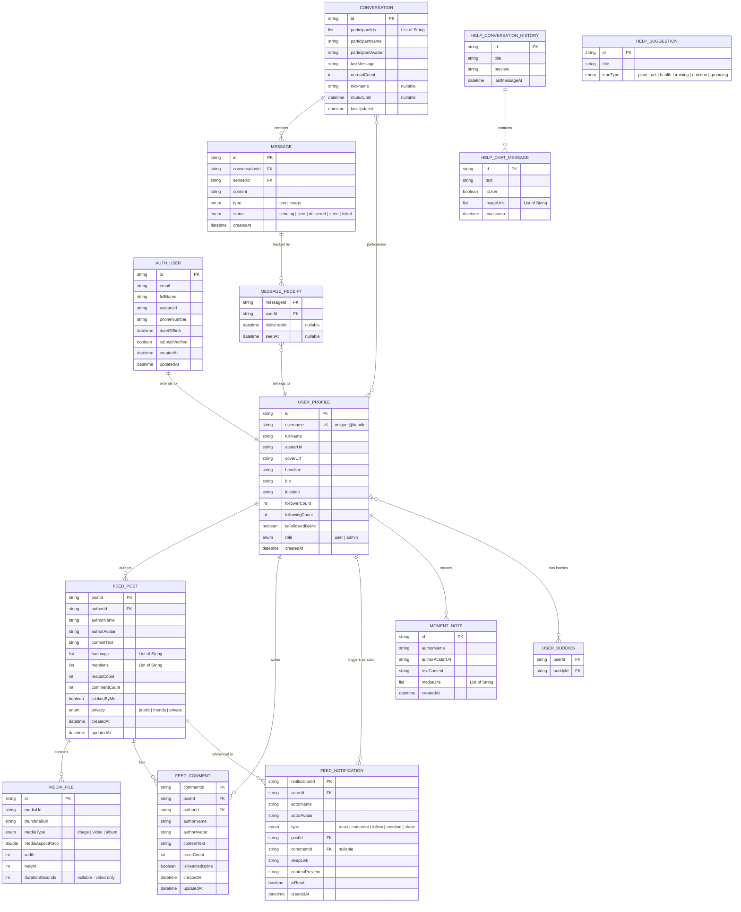

# 🗄️ HOMIES BUDDY - DATABASE DIAGRAM

> Database Schema & Entity Relationship Diagram cho Homies Buddy Developer

**Last Updated:** March 4, 2026

---

## 📊 Mermaid ER Diagram



---

## 📋 Entity Overview (14 Entities)

### 🔐 Authentication & User Management

#### 1. **AUTH_USER**
**Source:** [lib/features/auth/data/models/user_model.dart](lib/features/auth/data/models/user_model.dart)

Thông tin xác thực cơ bản của user (lightweight model).

| Field | Type | Description |
|---|---|---|
| `id` | string (PK) | User ID duy nhất |
| `email` | string | Email đăng nhập |
| `fullName` | string | Tên đầy đủ |
| `avatarUrl` | string? | URL avatar |
| `phoneNumber` | string? | Số điện thoại |
| `dateOfBirth` | datetime? | Ngày sinh |
| `isEmailVerified` | boolean | Trạng thái xác thực email |
| `createdAt` | datetime? | Thời gian tạo tài khoản |
| `updatedAt` | datetime? | Thời gian cập nhật cuối |

---

#### 2. **USER_PROFILE**
**Source:** [lib/data/models/user_model.dart](lib/data/models/user_model.dart)

Social profile đầy đủ với thông tin cộng đồng (SINGLE SOURCE OF TRUTH).

| Field | Type | Description |
|---|---|---|
| `id` | string (PK) | User ID |
| `username` | string (UK) | Username duy nhất (@handle) |
| `fullName` | string | Tên hiển thị |
| `avatarUrl` | string | Avatar tròn |
| `coverUrl` | string? | Ảnh bìa profile |
| `headline` | string? | Tiêu đề lớn (vd: "YOGA IN LIFE") |
| `bio` | string? | Giới thiệu bản thân |
| `location` | string? | Vị trí địa lý |
| `followerCount` | int | Số lượng người theo dõi |
| `followingCount` | int | Số lượng đang theo dõi |
| `isFollowedByMe` | boolean | Trạng thái follow của user hiện tại |
| `role` | enum | Vai trò: `user` \| `admin` |
| `createdAt` | datetime? | Thời gian tạo |

**Relationships:**
- Has many: `FEED_POST`, `FEED_COMMENT`, `FEED_NOTIFICATION`, `MOMENT_NOTE`
- Many-to-Many: `USER_BUDDIES` (Homies/bạn bè)

---

#### 3. **USER_BUDDIES**
**Source:** Embedded trong `UserModel.humanBuddies`

Quan hệ bạn bè giữa các users (Many-to-Many).

| Field | Type | Description |
|---|---|---|
| `userId` | string (FK) | User ID |
| `buddyId` | string (FK) | Friend User ID |

---

### 🌟 Community Feed (Tab Community)

#### 4. **FEED_POST**
**Source:** [lib/data/models/post_model.dart](lib/data/models/post_model.dart)

Bài viết trong Community Feed.

| Field | Type | Description |
|---|---|---|
| `postId` | string (PK) | Post ID duy nhất |
| `authorId` | string (FK) | User ID của tác giả |
| `authorName` | string | Tên tác giả |
| `authorAvatar` | string | Avatar tác giả |
| `contentText` | string | Nội dung bài viết |
| `hashtags` | List\<String\> | Danh sách hashtags |
| `mentions` | List\<String\> | Danh sách mentions (@username) |
| `reactsCount` | int | Số lượng react |
| `commentCount` | int | Số lượng comment |
| `isLikedByMe` | boolean | User hiện tại đã like chưa |
| `privacy` | enum | Chế độ: `public` \| `friends` \| `private` |
| `createdAt` | datetime | Thời gian đăng |
| `updatedAt` | datetime? | Thời gian chỉnh sửa |

**Relationships:**
- Belongs to: `USER_PROFILE`
- Has many: `MEDIA_FILE`, `FEED_COMMENT`, `FEED_NOTIFICATION`

---

#### 5. **MEDIA_FILE**
**Source:** [lib/data/models/media_file_model.dart](lib/data/models/media_file_model.dart)

Media đính kèm trong bài post (ảnh/video/album).

| Field | Type | Description |
|---|---|---|
| `id` | string (PK) | Media ID |
| `mediaUrl` | string | URL media chính |
| `thumbnailUrl` | string? | URL thumbnail |
| `mediaType` | enum | Loại: `image` \| `video` \| `album` |
| `mediaAspectRatio` | double | Tỷ lệ khung hình |
| `width` | int | Chiều rộng (px) |
| `height` | int | Chiều cao (px) |
| `durationSeconds` | int? | Thời lượng video (giây) |

**Relationships:**
- Belongs to: `FEED_POST`

---

#### 6. **FEED_COMMENT**
**Source:** [lib/data/models/comment_model.dart](lib/data/models/comment_model.dart)

Bình luận trên bài post.

| Field | Type | Description |
|---|---|---|
| `commentId` | string (PK) | Comment ID |
| `postId` | string (FK) | Post ID |
| `authorId` | string (FK) | User ID người comment |
| `authorName` | string | Tên người comment |
| `authorAvatar` | string | Avatar người comment |
| `contentText` | string | Nội dung comment |
| `reactCount` | int | Số lượng react |
| `isReactedByMe` | boolean | User hiện tại đã react chưa |
| `createdAt` | datetime | Thời gian comment |
| `updatedAt` | datetime? | Thời gian chỉnh sửa |

**Relationships:**
- Belongs to: `FEED_POST`, `USER_PROFILE`

---

#### 7. **FEED_NOTIFICATION**
**Source:** [lib/data/models/notification_model.dart](lib/data/models/notification_model.dart)

Thông báo về hoạt động trong Community.

| Field | Type | Description |
|---|---|---|
| `notificationId` | string (PK) | Notification ID |
| `actorId` | string (FK) | User ID người thực hiện action |
| `actorName` | string | Tên người thực hiện |
| `actorAvatar` | string | Avatar người thực hiện |
| `type` | enum | Loại: `react` \| `comment` \| `follow` \| `mention` \| `share` |
| `postId` | string (FK) | Post liên quan |
| `commentId` | string? (FK) | Comment liên quan (nullable) |
| `deepLink` | string | Deep link đến nội dung |
| `contentPreview` | string? | Xem trước nội dung |
| `isRead` | boolean | Đã đọc chưa |
| `createdAt` | datetime | Thời gian tạo |

**Relationships:**
- Belongs to: `USER_PROFILE`, `FEED_POST`

---

### 🏠 Home Tab

#### 8. **MOMENT_NOTE**
**Source:** [lib/data/models/moment_note_model.dart](lib/data/models/moment_note_model.dart)

Ghi chú/khoảnh khắc cá nhân trên trang Home.

| Field | Type | Description |
|---|---|---|
| `id` | string (PK) | Note ID |
| `authorName` | string | Tên tác giả |
| `authorAvatarUrl` | string | Avatar tác giả |
| `textContent` | string | Nội dung text |
| `mediaUrls` | List\<String\> | Danh sách URL media |
| `createdAt` | datetime | Thời gian tạo |

**Relationships:**
- Belongs to: `USER_PROFILE`

---

### 💬 Messaging (Chat Tab)

#### 9. **CONVERSATION**
**Source:** [lib/features/chat/data/models/conversation_model.dart](lib/features/chat/data/models/conversation_model.dart)

Cuộc trò chuyện giữa users.

| Field | Type | Description |
|---|---|---|
| `id` | string (PK) | Conversation ID |
| `participantIds` | List\<String\> | Danh sách User ID tham gia |
| `participantName` | string | Tên người chat |
| `participantAvatar` | string | Avatar người chat |
| `lastMessage` | string | Tin nhắn cuối cùng |
| `unreadCount` | int | Số tin chưa đọc |
| `nickname` | string? | Nickname tùy chỉnh |
| `mutedUntil` | datetime? | Tắt thông báo đến khi nào |
| `lastUpdated` | datetime | Thời gian cập nhật cuối |

**Relationships:**
- Many-to-Many: `USER_PROFILE`
- Has many: `MESSAGE`

---

#### 10. **MESSAGE**
**Source:** [lib/features/chat/data/models/message_model.dart](lib/features/chat/data/models/message_model.dart)

Tin nhắn trong cuộc trò chuyện.

| Field | Type | Description |
|---|---|---|
| `id` | string (PK) | Message ID |
| `conversationId` | string (FK) | Conversation ID |
| `senderId` | string (FK) | User ID người gửi |
| `content` | string | Nội dung tin nhắn |
| `type` | enum | Loại: `text` \| `image` |
| `status` | enum | Trạng thái: `sending` \| `sent` \| `delivered` \| `seen` \| `failed` |
| `createdAt` | datetime | Thời gian gửi |

**Relationships:**
- Belongs to: `CONVERSATION`
- Has many: `MESSAGE_RECEIPT`

---

#### 11. **MESSAGE_RECEIPT**
**Source:** [lib/features/chat/data/models/message_receipt_model.dart](lib/features/chat/data/models/message_receipt_model.dart)

Tracking trạng thái đã đọc của tin nhắn (per user).

| Field | Type | Description |
|---|---|---|
| `messageId` | string (FK) | Message ID |
| `userId` | string (FK) | User ID |
| `deliveredAt` | datetime? | Thời gian delivered |
| `seenAt` | datetime? | Thời gian seen |

**Relationships:**
- Belongs to: `MESSAGE`, `USER_PROFILE`

---

### 🤖 Help Assistant (Ask For Help Tab)

#### 12. **HELP_CONVERSATION_HISTORY**
**Source:** [lib/features/help/data/models/help_chat_model.dart](lib/features/help/data/models/help_chat_model.dart)

Lịch sử chat sessions với Mimi AI bot.

| Field | Type | Description |
|---|---|---|
| `id` | string (PK) | History ID |
| `title` | string | Tiêu đề session |
| `preview` | string | Xem trước nội dung |
| `lastMessageAt` | datetime | Thời gian tin nhắn cuối |

**Relationships:**
- Has many: `HELP_CHAT_MESSAGE`

---

#### 13. **HELP_CHAT_MESSAGE**
**Source:** [lib/features/help/data/models/help_chat_model.dart](lib/features/help/data/models/help_chat_model.dart)

Tin nhắn giữa user và Mimi AI bot.

| Field | Type | Description |
|---|---|---|
| `id` | string (PK) | Message ID |
| `text` | string | Nội dung tin nhắn |
| `isUser` | boolean | Từ user (true) hay bot (false) |
| `imageUrls` | List\<String\> | Danh sách ảnh đính kèm |
| `timestamp` | datetime | Thời gian tin nhắn |

**Relationships:**
- Belongs to: `HELP_CONVERSATION_HISTORY`

---

#### 14. **HELP_SUGGESTION**
**Source:** [lib/features/help/data/models/help_chat_model.dart](lib/features/help/data/models/help_chat_model.dart)

Gợi ý trợ giúp (standalone, không có foreign key).

| Field | Type | Description |
|---|---|---|
| `id` | string (PK) | Suggestion ID |
| `title` | string | Tiêu đề gợi ý |
| `iconType` | enum | Icon: `plant` \| `pet` \| `health` \| `training` \| `nutrition` \| `grooming` |

---

## 🔗 Relationship Summary

| Parent Entity | Relationship | Child Entity | Type |
|---|---|---|---|
| AUTH_USER | extends to | USER_PROFILE | 1:1 |
| USER_PROFILE | authors | FEED_POST | 1:N |
| USER_PROFILE | writes | FEED_COMMENT | 1:N |
| USER_PROFILE | triggers | FEED_NOTIFICATION | 1:N |
| USER_PROFILE | creates | MOMENT_NOTE | 1:N |
| USER_PROFILE | has homies | USER_BUDDIES | M:N |
| USER_PROFILE | participates | CONVERSATION | M:N |
| FEED_POST | contains | MEDIA_FILE | 1:N |
| FEED_POST | has | FEED_COMMENT | 1:N |
| FEED_POST | referenced in | FEED_NOTIFICATION | 1:N |
| CONVERSATION | contains | MESSAGE | 1:N |
| MESSAGE | tracked by | MESSAGE_RECEIPT | 1:N |
| MESSAGE_RECEIPT | belongs to | USER_PROFILE | N:1 |
| HELP_CONVERSATION_HISTORY | contains | HELP_CHAT_MESSAGE | 1:N |

---

## 🎨 Enums Reference

### UserRole
```dart
enum UserRole {
  user,   // 👤 Người dùng thông thường
  admin   // 👑 Quản trị viên
}
```

### PostPrivacy
```dart
enum PostPrivacy {
  public,   // 🌍 Công khai
  friends,  // 👥 Bạn bè
  private   // 🔒 Riêng tư
}
```

### MediaType
```dart
enum MediaType {
  image,  // 🖼️ Hình ảnh
  video,  // 🎥 Video
  album   // 📷 Album
}
```

### NotificationType
```dart
enum NotificationType {
  react,    // ❤️ Thích bài viết
  comment,  // 💬 Bình luận
  follow,   // 👤 Theo dõi
  mention,  // @️⃣ Nhắc đến
  share     // 🔄 Chia sẻ
}
```

### MessageType
```dart
enum MessageType {
  text,   // 📝 Text
  image   // 🖼️ Image
}
```

### MessageStatus
```dart
enum MessageStatus {
  sending,    // ⏳ Đang gửi
  sent,       // ✓ Đã gửi
  delivered,  // ✓✓ Đã nhận
  seen,       // 👁️ Đã xem
  failed      // ❌ Thất bại
}
```

### IconType (Help Suggestions)
```dart
enum IconType {
  plant,      // 🌱 Cây cối
  pet,        // 🐾 Thú cưng
  health,     // 🏥 Sức khỏe
  training,   // 🎓 Huấn luyện
  nutrition,  // 🍖 Dinh dưỡng
  grooming    // ✂️ Chăm sóc
}
```

---

## 📁 File Structure Reference

```
lib/
├── data/
│   └── models/
│       ├── user_model.dart              # USER_PROFILE
│       ├── post_model.dart              # FEED_POST
│       ├── comment_model.dart           # FEED_COMMENT
│       ├── notification_model.dart      # FEED_NOTIFICATION
│       ├── media_file_model.dart        # MEDIA_FILE
│       ├── moment_note_model.dart       # MOMENT_NOTE
│       └── enums/
│           ├── post_privacy.dart
│           ├── media_type.dart
│           └── notification_type.dart
│
└── features/
    ├── auth/
    │   └── data/models/
    │       └── user_model.dart          # AUTH_USER
    │
    ├── chat/
    │   └── data/models/
    │       ├── conversation_model.dart  # CONVERSATION
    │       ├── message_model.dart       # MESSAGE
    │       ├── message_receipt_model.dart # MESSAGE_RECEIPT
    │       ├── message_type.dart
    │       └── message_status.dart
    │
    └── help/
        └── data/models/
            └── help_chat_model.dart     # HELP_* entities
```

---

## 🚀 Technology Stack

- **Framework:** Flutter (Dart)
- **State Management:** Flutter Riverpod
- **Code Generation:** Freezed, json_serializable
- **Database (planned):** Firebase Firestore / MongoDB
- **Real-time:** WebSocket (socket_io_client)

---

**Version:** 1.0.0  
**Generated:** March 4, 2026  
**Project:** Homies Buddy Developer
